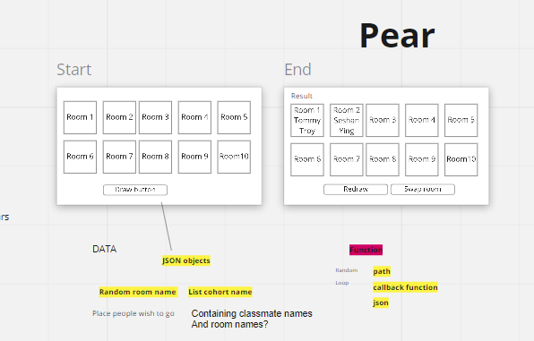

# Pear

## Deployment on Heroku
https://pear-dev.herokuapp.com/

## software design in Miro

https://miro.com/app/board/o9J_lojxAyk=/

## Main features

1. Randomly pick two students for a pair programming
1. Assign them to a empty room

##  Strethes
1. Student images
1. Raw data file with room names (data.json)
1. Source and add images for each student
1. Ability to change group size
1. Ability to edit student names

## Development guide
1. Clone the feature branch
1. Run `npm i`
1. Run `npm run dev` to start the server 
1. Go to http://localhost:3000 to see if the app is running properly
1. Make a new branch named after your name
1. Make changes
1. Commit the changes and push to your named branch
1. Make a pull request from your named branch to the feature branch

## Testing, source code integration and deployment
1. Testing will be done on the feature branch
1. After all the tests pass, it will be merged into the main branch
1. The source code on the main branch will be deployed to the server(Heroku)